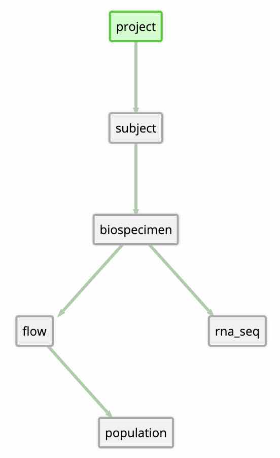

```{r, echo=FALSE, results="hide", message=FALSE}
knitr::opts_chunk$set(error=FALSE, message=FALSE, warning=FALSE)
library(BiocStyle)
library(magmaR)
library(vcr)

TOKEN <- magmaR:::.get_sysenv_or_mock("TOKEN")
prod <- magmaRset(TOKEN)

vcr::vcr_configure(
    filter_sensitive_data = list("<<<my_token>>>" = TOKEN),
    dir = "../tests/fixtures"
)
insert_cassette(name = "Upload-vignette")
```

# Introduction

## Mini overview of magmaR, magma, and the Mount Etna data library system

This vignette focuses on how to upload data to **magma** via its R-client, **magmaR**.

Magma is the *data warehouse* of the **Mount Etna data library system**.

For a deeper overview of the structure of magma and the Mount Etna data library system, please see the download-focused vignette, `vignette("Download", package = "magmaR")`, or Mount Etna's own documentation, here https://mountetna.github.io/magma.html.

## Scope of this vignette

This vignette assumes that you have already gone through the download-focused vignette, `vignette("Download", package = "magmaR")`, which covers how to 1) install magmaR, 2) use a *token* for authentication, and 3) switch, if needed, between the production / staging / development magma environments.

This vignette focuses on use-cases where a user wishes to push data, from their own system, to magma.

Not all Mount Etna users have write privileges, so not all magmaR users will have need for this vignette.

For those that do, please note: ***Sending data to magma is an advanced use-case which needs to be treated with due care.*** The functions involved have the ability to overwrite data, so it is imperative, for data integrity purposes, that inputs to these functions are double-checked in order to make sure that they target only the intended records & attributes.

Also note that a users' write-privileges are project-specific, so it is unlikely that you will be able to run any code, exactly as it exists in this vignette, without getting an authorization error. (That also means you don't run the risk of breaking our download vignette by testing out any fun alterations of the code in here... trade-offs =] .)

## How magmaR functions work

In general, magmaR functions will:

1. Take in inputs from the user.
2. Perform some amount of input parsing and transformation.
3. Make a curl request to magma via magma's own `retrieve`, `query`, or `update` functions to send or receive desired data.
4. Restructure any received data, typically minimally, to be more accessible for downstream analyses.
5. Return the output.

Steps 4&5 are very simple for upload functions because the only return from magma will be curl request attributes that indicate whether the call to `magma/update` worked.

So in this vignette, our singular focus will be on how to input your data so that magmaR can send it to magma properly.

# Upload Functions

## Overview

**The base function:**

- **`updateValues()`** = a few-frills wrapper of **magma**'s sole data input function, **`/update`**.  It's quite flexible, but that flexibility owes largely to a rigid input structure, so we provide a few wrapper functions which make some common upload needs easier.

**Convenient wrapper functions:**

- **`updateFromDF()`** allows update of a set of attributes, of multiple records, via a simple `data.frame` structure, or via a csv/tsv file encoding such data.
- **`updateMatrix()`** allows update of a matrix-type attribute, of multiple records, directly from an R `matrix`, `data.frame`, or a csv/tsv file encoding such data.

## Common features

Jumping in, the first thing to know is that **all magmaR update functions will**: 

- **Summarize** updates to be made, prior to payload transfer to magma.
  - Currently, the summary describes record IDs for each mode that would be created or updated, but that summary may grow in the future.
- **Prompt the user to check** that the summary matches their intended updates before proceeding, unless the input `auto.proceed` is set to FALSE.
- **Perform the Update and Report Status**, success/failure, of the post to `magma/update`, including any error messages returned.

For example, after running some magmaR update code, you might see a summary like this:

```
For model "rna_seq", this update() will create 3 NEW records:
    ID1
    ID2
    ID3
WARNING: Check the above carefully. Once created, there is no easy way to remove records from magma.
For model "biospecimen", this update() will update 2 records:
    EXAMPLE-HS1-WB1
    EXAMPLE-HS2-WB1
For model "rna_seq", this update() will update 1 records:
    EXAMPLE-HS1-WB1-RSQ1

Proceed, Y/n?
```

It is highly recommended that these summaries be checked carefully for accuracy before proceeding as `update`s have the power to overwrite magmaR data!  There is currently no history tracking in magma, so updates cannot be rolled back.

Also, contrary to the "update" portion of the function names, these functions can add totally new data to magma records.

Once created, it is not easy to fully remove records with an incorrect ID.

**So, especially if you get a WARNING message like in the example above, we recommend to always double-check the summary output before proceeding!**

That said, it is possible to bypass the user-prompt step.

To continue with your upload, simply enter `y`, `yes`, or the like, and hit `enter` to proceed.
Or, enter anything else to stop.

After a successful `update()` users will see this message (unless `verbose` has been set to `FALSE`):

```
/update: successful.
```

### Running non-interactively

In cases where you are trying to automate uploads with a script, inputting "yes" to proceed is not possible.
In such cases, the user-prompt step can also be turned off by adding the input `auto.proceed = TRUE`. 

Of course, extra care should be taken to ensure proper payload generation.

Example:

```{r}
revs <- list(
    "biospecimen" = list(
        "EXAMPLE-HS1-WB1" = list(biospecimen_type = "Whole Blood"),
        "EXAMPLE-HS2-WB1" = list(biospecimen_type = "Whole Blood")
        ),
    "rna_seq" = list(
        "EXAMPLE-HS1-WB1-RSQ1" = list(fraction = "Tcells")
    )
)
updateValues(
    target = prod,
    project = "example",
    revisions = revs,
    auto.proceed = TRUE) ## <---
```

### Example Data

Examples in this vignette will target the same "example" project used in the download vignette.

To refresh, the model map for that project is below.



The "biospecimen" and "rna_seq" models will be our particular targets, and have attributes...

```{r}
library(magmaR)
retrieveAttributes(target = prod, "example", "biospecimen")
retrieveAttributes(target = prod, "example", "rna_seq")
```

## Function Details

### updateMatrix()

As the name suggests, `updateMatrix()` is meant specifically for matrix data. It allows a user to point magmaR to either a file containing matrix data, or to a readily constructed matrix, without needing to perform the manual conversion of such data to the complicated `revisions`-input format of the `updateValues()` function. 

Internally, the function performs some necessary validations, adjusts the matrix into the `revisions`-input format of `updateValues()`, then passes its payload along to `updateValues()` where all the common update functionality is housed.

#### Necessary inputs:

In addition to the normal `target` and `projectName` inputs here, `modelName`, and `attributeName` are also used to direct where to upload your matrix data.

A separate `matrix` input takes in the target data. This can be given a matrix or data.frame directly, or a string representing the path to a csv or tsv file containing such data. In all cases, `matrix` must be formatted to have:

- Column Names (or the first row when providing a file) = the identifiers of target records
- Column Data = the values for each record
- Row Names (or the first column when providing a file) = the names of what data is in each row, ex: gene ids for rna_Seq data. These must be among the allowed 'options' for the target attribute. (See the 'See Also' section of `?updateMatrix` for one method of finding out what these 'options' are.)

When `matrix` points to a file, the optional `separator` input can be used to indicate between csv (default assumption) versus tsv parsing.

**Example:**

To update the raw counts of our "rna_seq" model from either a csv, a tsv, or directly from a matrix, we could use the code below:

```{r, eval = FALSE}
### From a csv
updateMatrix(
    target = prod,
    projectName = "example",
    modelName = "rna_seq",
    attributeName = "gene_counts",
    matrix = "path/to/rna_seq_counts.csv")

### From a tsv, set the 'separator' input to "\t"
updateMatrix(
    target = prod,
    projectName = "example",
    modelName = "rna_seq",
    attributeName = "gene_counts",
    matrix = "path/to/rna_seq_counts.tsv",
    # Use separator to adjust parsing for tab-separated values
    separator = "\t")

### From an already loaded matrix:
matrix <- retrieveMatrix(target = prod, "example", "rna_seq", "all", "gene_counts")
updateMatrix(
    target = prod,
    projectName = "example",
    modelName = "rna_seq",
    attributeName = "gene_counts",
    matrix = matrix)
```

Let's explore the structure of `matrix` a little bit, noting that:

1. Column names for the matrix are record identifiers for the target "rna_seq" model.
2. Row names for the matrix are the feature-names for the matrix. So for rna_seq data, for example, these will be gene names of some type, typically Ensembl IDs.

```{r, include = FALSE}
matrix <- retrieveMatrix(target = prod, "example", "rna_seq", "all", "gene_counts")
```

```{r}
head(matrix, n = c(6,2))
```

### updateFromDF()

This function allows easy update of a set of attributes for of multiple records, via a rectangular data input structure.

Utility: When aiming to update the same set of attributes for many different records, which is probably the most common case when wanting to upload data, use this function.

Internally, the function performs some necessary validations, adjusts the df into the rigid `revisions`-input format of `updateValues()`, then passes its payload along to `updateValues()` where all the common update functionality is housed.

#### Necessary inputs:

In addition to the normal `target` and `projectName` inputs, here a `modelName` is also needed in order to direct where to upload your data.

A separate `df` input then takes in the target data. `df` can be given as data.frame directly, or as a string representing the path to a csv or tsv file containing such data. In all cases, `df` must be formatted to have:

- Rows = records, with the first column indicating the record identifiers.
- Columns = represent the data desired to be given for each attribute.
- Column Names (or the first row when providing a file) = attribute names. Except for the first column (ignored as this column's data are used as identifiers), all column names must be valid attribute names of the target modelName.

When `df` points to a file, the optional `separator` input can be used to indicate between csv (default assumption) versus tsv parsing.

**Example:**

To update multiple attributes of multiple records of our "rna_seq" model from either a csv, a tsv, or directly from a data.frame, we could use the code below:

```{r, eval = FALSE}
### From a csv
updateFromDF(
    target = prod,
    projectName = "example",
    modelName = "rna_seq",
    df = "path/to/rna_seq_attributes.csv")

### From a tsv, set the 'separator' input to "\t"
updateFromDF(
    target = prod,
    projectName = "example",
    modelName = "rna_seq",
    df = "path/to/rna_seq_attributes.tsv",
    # Use separator to adjust parsing for tab-separated values
    separator = "\t")

### From an already loaded data.frame:
df <- retrieve(target = prod, "example", "rna_seq", "all",
               c("tube_name", "cell_number", "fraction"))
updateFromDF(
    target = prod,
    projectName = "example",
    modelName = "rna_seq",
    df = df)
```

Let's explore the structure of `df` a little bit, noting that:

1. The left-most column holds record identifiers.
2. Column 2 onwards are data columns which hold intended data for attributes of each target record.
3. Column names for column 2 onwards are the target attribute-names.

```{r, include = FALSE}
df <- retrieve(target = prod, "example", "rna_seq", "all",
               c("tube_name", "cell_number", "fraction"))
```

```{r}
head(df, n = c(6,3))
```

*One final note:* The identifier column's name, though accurately the name of the identifier attribute here, does not actually matter. 'tube_name' is the name of the identifier attribute of this "rna_seq" model, but we could have named the column anything. This is an intended feature as it allows users to adjust records' identifiers with this function by providing a separate data column, of new identifiers, with the identifier attribute name as its name!

### updateValues()

`updateValues()` is the main workhorse function of `magmaR`'s data upload capabilities. It largely mimics `magma/update`, where each target model, record, and attribute are indicated individually, thus giving very flexible control. The function relies on a rigid nested list structure for providing such data. This `revisions` input structure can feel a bit clunky, but is ultimately very powerful.

Utility: Useful for smaller updates, and for any updates that cannot be handled with the `updateFromDF()` and `updateMatrix()` wrappers.

#### Necessary inputs:

In addition to the normal `target` and `projectName` inputs, `revisions` is the primary input of `updateValues()`:

- `revisions` includes information about which model(s), which record(s), and which attribute(s) to update, and with what value(s). Each of these levels are encoded as a nested list where the format looks something like:

```
revisions = list(
    modelName = list(
        recordName = list(
            attributeName = value(s)
        )
    )
)
```

To make more than one update within a single call, you can simply add an additional index at any of these levels.

For example, the below `revisions` would encode some very different updates

```
# 2 attributes for the same record
revisions = list(
    modelName = list(
        recordName = list(
            attributeName1 = value(s),
            attributeName2 = value(s)
            )
        )
    )

# The same attribute for 2 different records
revisions = list(
    modelName = list(
        recordName1 = list(
            attributeName1 = value(s)
            ),
        recordName2 = list(
            attributeName1 = value(s)
            )
        )
    )

# Some attribute for 2 different records of two different models
revisions = list(
    modelName1 = list(
        recordName1 = list(
            attributeName1 = value(s)
            )
        ),
    modelName2 = list(
        recordName2 = list(
            attributeName2 = value(s)
            )
        )
    )
```

Say we wanted to update the "biospecimen_type" attribute of 2 records from the "biospecimen" model, and the "fraction" attribute for 1 record from the "rna_seq" model. The code for this could be:

```{r, eval = FALSE}
# Create 'revisions'
revs <- list(
    "biospecimen" = list(
        "EXAMPLE-HS1-WB1" = list(biospecimen_type = "Whole Blood"),
        "EXAMPLE-HS2-WB1" = list(biospecimen_type = "Whole Blood")
        ),
    "rna_seq" = list(
        "EXAMPLE-HS1-WB1-RSQ1" = list(fraction = "Tcells")
    )
)

# Run update()
updateValues(
    target = prod,
    project = "example",
    revisions = revs)
```

A user would then see a summary of models/records to be updated, followed by a prompt to proceed or not:

```
For model "biospecimen", this update() will update 2 records:
    EXAMPLE-HS1-WB1
    EXAMPLE-HS2-WB1
For model "rna_seq", this update() will update 1 records:
    EXAMPLE-HS1-WB1-RSQ1

Proceed, Y/n?
```

As mentioned previously, it is highly recommended that summary outputs be checked carefully for accuracy before proceeding.

However, for running `update*()` code in non-interactive modes, like scripts or .Rmd knits, this user-prompt step can also be turned off by adding the input `auto.proceed = TRUE`.  Example:

```{r, include = FALSE}
revs <- list(
    "biospecimen" = list(
        "EXAMPLE-HS1-WB1" = list(biospecimen_type = "Whole Blood"),
        "EXAMPLE-HS2-WB1" = list(biospecimen_type = "Whole Blood")
        ),
    "rna_seq" = list(
        "EXAMPLE-HS1-WB1-RSQ1" = list(fraction = "Tcells")
    )
)
```

```{r}
updateValues(
    target = prod,
    project = "example",
    revisions = revs,
    auto.proceed = TRUE)
```

After a successful `update()` a user should see this message (unless `verbose` has been set to `FALSE`):

```
/update: successful.
```

# Session information

```{r, include = FALSE}
eject_cassette()
```

```{r}
sessionInfo()
```
