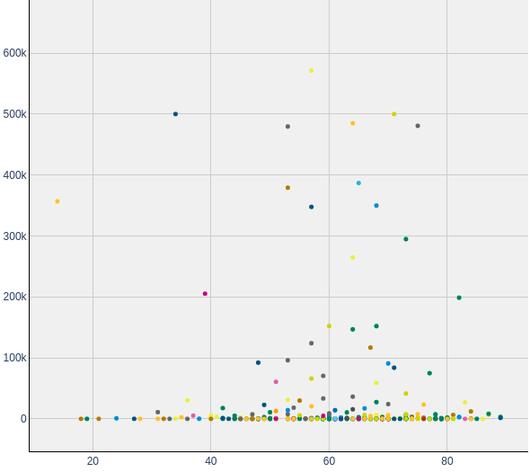
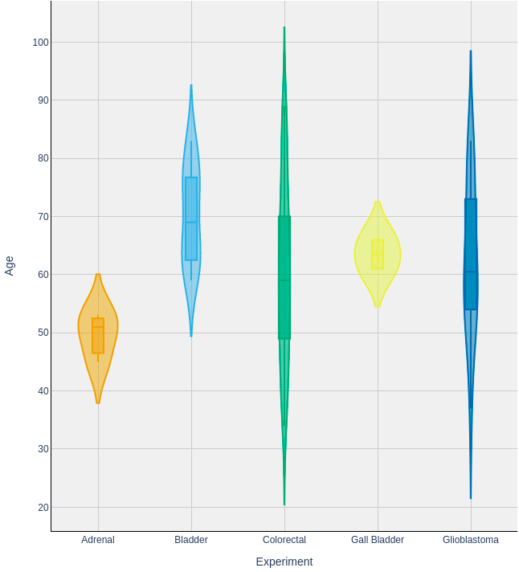
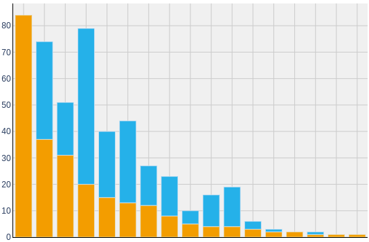
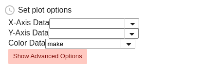
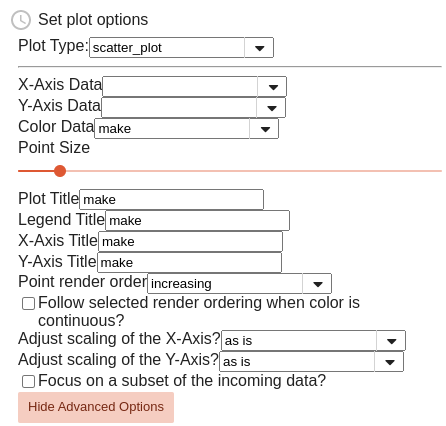

# Vulcan
{:.no_toc}

## Calculation Service
{:.no_toc}

Vulcan provides tools for doing analysis of data in Mount Etna.

* TOC
{:toc}

### Workflows

Workflows integrate calculation and user interactions to produce files, plots,
tables and other kinds of outputs. Workflows can be very simple, such as
selecting some data and using it to create a visualization, or they can be very
complex, like a complete, user-guided single-cell sequencing analysis.

A Vulcan workflow is defined in the Common Workflow Language (CWL,
https://www.commonwl.org/user_guide) and runs steps which run Python code or
mediate user interactions.  Users may interact with workflows in the Vulcan UI,
setting input parameters and queueing the workflow to be run by Vulcan.
Subsequently the workflow is executed by Vulcan in a sandboxed Python
environment called Archimedes.

A workflow consists of a set of primary inputs and a set of steps, each with
defined inputs and outputs.  The workflow begins with the primary inputs, and
each subsequent step depends on either primary inputs or the output of a
previous step (producing a directed acyclic graph or DAG).

Here is an example workflow, written in CWL.

     inputs:
       anotherInt:
         type: int
       someInt:
         type: int
     
     steps:
       calcSum:
         run: scripts/add.cwl
         in:
           a: someInt
           b: anotherInt
         out: [sum]
       pickANum:
         run: ui-queries/int.cwl
         in:
           num: calcSum/sum
         out: [num]
       showSum:
         run: ui-outputs/raw.cwl
         in:
           a: pickANum/num
         out: []

The first step in the example makes the two primary inputs `someInt` and
`anotherInt` available to a python script as inputs `a` and `b`. Here is the
corresponding Python script `add.py`:

    from archimedes.functions.dataflow import output_path, input_path

    a = int(open(input_path('a'), 'r').read())
    b = int(open(input_path('b'), 'r').read())

    with open(output_path('sum'), 'w') as output_file:
        output_file.write(str(a + b))

When the step writes output to the appropriate file location, it becomes
available to subsequent (dependent) steps in the workflow. It also becomes part
of Vulcan's cache.

The second step is a UI query step, which uses output from previous steps to
request input from the user using one of Vulcan's query widgets (e.g., a text
box with a label returning an integer), allowing the user to make a response
and write it into the cache for subsequent steps.  There is no associated
Python code; the Vulcan orchestrator will pass the appropriate instruction to
the UI for `ui-queries`.

The last step in the example workflow generates output instructions for the
Vulcan UI, which can be any of a number of output artifacts: an image, a file
download, a table, an interactive plot, etc.

### Vulcan Cache

The cache is an ephemeral data store that holds all of the output produced by
running workflows. Each step in the workflow, when it completes, stores data in
a cache location.  On subsequent runs, if there is already a cached output for
the step, it will be used instead of rerunning the step.  By making use of
cached intermediates, Vulcan workflows can minimize the amount of calculation
required by iteration.

If the inputs or the script for a step change, the location of the step cache
will also change, and Vulcan will look for output in the new location. Note
that the "new" location may also be a previously cached state (e.g., if you
toggle back and forth between two input values). In addition each workflow
session contains a unique key, which if reset will change the cache locations.

### Running a Workflow

Workflows can be run in the Vulcan UI. To run a workflow, navigate to your
project page from the Vulcan root page. Select one of the available workflows
and the Vulcan Workflow UI will appear with a new workflow session.

The interface is divided into three columns.
  - On the left, the user may configure primary inputs, or, once the workflow is running, UI query inputs
created by the workflow.
  - Outputs, such as plots or download links, appear in the second column.
  - The final column shows the steps in the workflow in the order they will run (approximately, since the workflow may branch).

The user may change inputs as they see fit; changes will not be persisted to
the session until the user saves their edits to each required input using the
"Commit" button. Once the session is updated with new inputs, Vulcan will note
that some steps in the workflow can be run to produce new outputs and will
enable the "Run" button.

Upon running, the workflow will run until it completes, encounters an error, or
requires further input from the user to continue.

### Visualization Workflows

Some of the most basic, yet likely to be most used workflows of the Vulcan arsenal, these workflows consist of just a few steps where the first is a data query piece (which can be filled in via a [Timur-Query](https://mountetna.github.io/timur.html#query)) followed by a user input step where the user configures how their plot should be generated.

Plot-types currently available are:

| Scatter | Y (integrated violin and boxplots) | Bar |
| --- | --- | --- |
|  |  | |

Each plot type has its own dedicated workflow and an associated vignette where additional details may be given about how particular plots are made.

#### The Plot Configuration Interface

**Main Options:** Before a plot can be made from a given set of data, vulcan must be told what parts of the data to map to axes, colors, etc. The "main" inputs of the configuration interface fill in such mappings and are always displayed.  For example, when setting up a scatter plot you would see:

**Advanced Options:** Within the same interface, a set of 'Advanced Options' allow additional tweaks to be made to how the plot will show up, but these are hidden behind a button by default.  Clicking the "Show Advanced Options" button of the configuration interface for a scatter plot will reveal:

Often, you will see inputs filled in by default with 'make'.  'make' is our chosen fill-in for telling the system to "Use the default option," so leaving such inputs as 'make' will let our system fill in that setting with an intuitive default.  Such inputs may be adjusted, or not, as needed.

We use a single system to serve the Plot Configuration Interface for all plot types.  Thus, even though each plot type requires distinct sets of data mappings and offers a distinct set of advanced options, you can be sure that when a given input does shows up, its behaviour within this interface will be the same across all plot types!

Below is a table explaining each input and how to use them:

| Label within the Plot Configuration Interface | Plot Types which use these inputs | Purpose & How to use |
| ---- |---| ----------- |
| X-Axis Data, Y-Axis Data | All | These dropdowns present column names of the incoming data for the user to select which column to use for the X and Y axes. |
| Color Data | Scatter & Y | This dropdown presents column names of the incoming data for the user to select which column to use for coloring points. It also injects an option of 'make', the default, which translates to 'all one color' for scatter plots or 'the X-Axis Data selection' for Y Plots |
| Scale Y by counts or fraction? | Bar | This dropdown allows users to pick whether the y-axis of the resultant Bar Plot will be in proportaion to raw 'counts' per group, or by 'fraction' composition of each group in which every bar will have a height of 1. |
| Data Representations | Y | The multi-select ui for this input allows users to select which visual representations of their data to show in the plot: either violin plots, box plots, or both. |
| Plot Title, Legend Title, X-Axis Title, Y-Axis Title | All | String inputs which allow the user to provide custom titles. |
| Point render order | Scatter | When 'Color Data' is given a discrete data column, this dropdown -- of 'increasing', 'decreasing', or 'unordered' -- determines both the order by which colors get asigned to groups and their plotting order from back-to-front. |
| Follow selected render ordering when color is continuous? | Scatter | When 'Color Data' is given a numeric data column, this checkbox input controls whether to follow the 'Point render order' selection for ordering the rendering of data points from back-to-front. |
| Point Size | Scatter | This slider adjusts how large data points will be in scatter plots |
| Adjust scaling of the X-Axis?, Adjust scaling of the Y-Axis? | Scatter & Y | These dropdowns allow the user to change the scaling of the x and/or y axes from the default of 'as is' / linear scaling, into log10 scaling via two options: 'log10' simply converts scaling to log-scale; 'log10(val+1)' adds 1 to all values then converts scaling to log-scale, thus allowing data with zeros (log(0) essentially translates to negative infinity!) to render more intuitively. |
| Focus on a subset of the incoming data? | All | This initally simple checkbox input, which expands into a much more detailed structure when enabled, allows the user to select a subset of rows of the incoming data to focus their plot on. In the expanded form, the user is able to construct one or more conditions that must be met in order for a given data point / row of the data frame to be plotted. Within this UI: 'Target #:' dropdowns select what column of data to focus on for a given condition's definition. After this data is selected, additional UI pieces show up to allow the user to finish setting up that condition by selecting what data to keep. Additional conditions can be added with the 'Add another condition?' button, and any number of additional conditions can be added, depending of the user's needs. Each new condition will come with one new piece, a 'Combination Logic:' dropdown which can be either 'and' or 'or'. The combination logic determines whether data points need to pass **both** the preceding and current condition ('and') versus just one ('or'). When many 'and's or 'or's are needed, it's useful to know that the way this logic is parsed is as if any adjacent 'and's are wrapped within parenthesis, with 'or's being calculated afterward.  So if 5 conditions are used and linked by 'or', 'and', 'or', 'and', the effective check will be: (condition1) OR (condition2 AND condition3) OR (conditon4 AND condition5). |